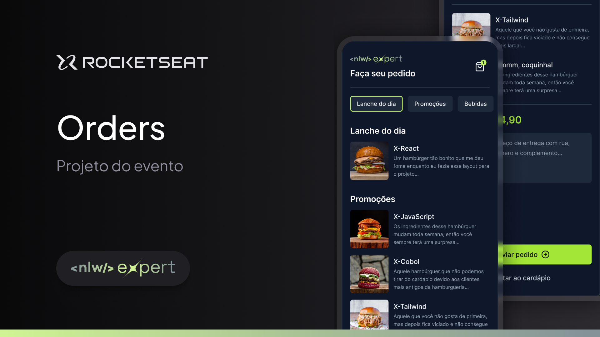

<h1 align="center" style="display: flex; align-items: center; width: 100%; justify-content: center; gap: 1rem;" >
    
Food App

</h1>

Este é um projeto de protótipo, onde aprendi melhor o funcionamento do React Native, para que futuramente posso vir a criar um app para ajudar minha mãe em seu trabalho. No app, monte seu lanche e mande uma mensagem pronta via WhatsApp para a empresa! 

  <a href="#-tecnologias">Tecnologias</a>&nbsp;&nbsp;&nbsp;|&nbsp;&nbsp;&nbsp;
  <a href="#-projeto">Projeto</a>&nbsp;&nbsp;&nbsp;|&nbsp;&nbsp;&nbsp;
  <a href="#-layout">Layout</a>&nbsp;&nbsp;&nbsp;|&nbsp;&nbsp;&nbsp;
  <a href="#memo-licença">Licença</a>

  

 

  

## 🚀 Tecnologias

Esse projeto foi desenvolvido com as seguintes tecnologias:

- HTML, CSS e JavaScript
- Git e Github
- Biblotecas:
    - [react-native](https://reactnative.dev/)
    - [expo](https://expo.dev/)
    - [tailwindcss](https://tailwindcss.com/)
    - [nativewind](https://www.nativewind.dev/)
    - [zustand](https://github.com/pmndrs/zustand)
    - [async-storager](https://docs.expo.dev/versions/latest/sdk/async-storage/)
    - [typescript](https://www.typescriptlang.org/)

## 💻 Projeto

O projeto é uma plataforma de compra de comida, onde não há transferências e sim um pedido especializado e encaminhado diretamente para o WhatsApp da empresa, com os valores, pedidos e endereço do cliente.

## :memo: Licença

Esse projeto está sob a licença MIT.

---

## ✍ Author
 

    Made with 💜 by Pedro Henrique Klein

    
    

